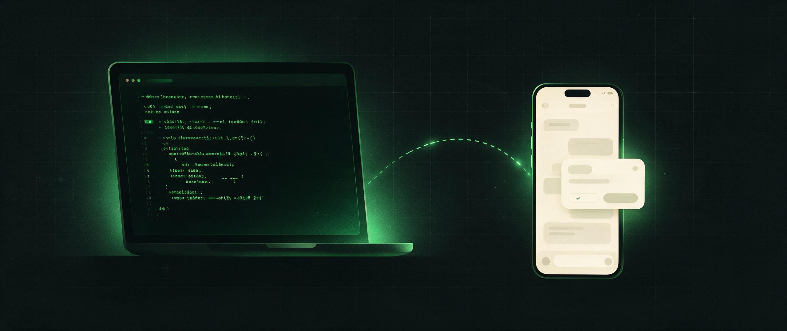

<div align="center">



# Riffpad

**The pocket remote for your AI coding agents.**

Watch, approve, and steer Claude Code, Codex, and other AI coding CLIs from your phone — without staying chained to the desk.

[](https://github.com/riffpad/riffpad/actions/workflows/ci.yml)
[](https://github.com/riffpad/riffpad/stargazers)
[](https://www.riffpad.ai/docs/guide/quickstart)
[](https://discord.gg/CDNFTg2QyM)

[Website](https://riffpad.ai) · [Documentation](https://www.riffpad.ai/docs/guide/quickstart) · [Discord community](https://discord.gg/CDNFTg2QyM) · [App](https://app.riffpad.ai)

[English](README.md) · [中文](README.zh-CN.md)

</div>

---

## Why Riffpad?

AI coding agents are powerful — and needy. They pause for approvals, finish tasks while you're away, and quietly wait for input you could have given from the couch. Riffpad bridges the CLI agents running on your own machine to your phone, so a long refactor doesn't chain you to the desk:

- **Watch from anywhere** — live event stream of every session, mirrored to your phone in real time.
- **Approve in one tap** — permission prompts become approval cards; decide from the couch, the office, or the subway.
- **Steer remotely** — send messages and course-correct a running session without SSH or screen-sharing hacks.
- **Nothing leaves your machine unencrypted** — end-to-end encryption with a zero-knowledge relay, local-first by design.
- **Read-only by default** — every approve, reject, or prompt is an explicit action, never ambient access.


## Quickstart

### 1. Install the daemon

**macOS / Linux**

```bash
curl -fsSL https://riffpad.ai/install.sh | sh
```

**Windows PowerShell**

```powershell
irm https://riffpad.ai/install.ps1 | iex
```

The Windows script downloads the latest binary, adds it to your user PATH, and
registers a logon autostart task for the daemon.

### 2. Sign in on the computer

```bash
riffpad login
```

This opens a browser for GitHub authorization (like `gh auth login`). The
daemon registers this computer as a host under your account and restarts
automatically.

### 3. Pair your phone

```bash
riffpad pair
```

The terminal prints a 6-character code and a QR code. On your phone, open
[https://app.riffpad.ai](https://app.riffpad.ai), sign in with the **same**
GitHub account, and enter the code (or scan the QR).

### 4. Start and control a session

```bash
riffpad run --cli codex
```

The session appears in the app immediately — watch progress, approve actions,
and send instructions from your phone, from anywhere.

The CLI speaks English and Chinese. It detects your locale from
`LC_ALL`/`LC_MESSAGES`/`LANG`; override it anytime with
`riffpad --lang zh` or `riffpad --lang en`. Unsupported locales fall back to
English.

> Want to capture a Claude session you started yourself? Use `riffpad attach`
> instead — see the [documentation](https://www.riffpad.ai/docs/guide/quickstart).

## How it works


- **Adapter** — parses each CLI's structured output and hooks into a unified event stream (Claude Code, Codex, DeepSeek, Kimi, …).
- **Daemon** — runs on your computer, owns the keys, manages sessions, and bridges adapters to the relay.
- **Relay** — lightweight encrypted WebSocket relay. Zero-knowledge: it routes ciphertext and stores nothing.
- **Mobile app** — shows sessions and approval cards, and sends approve / reject / prompt actions back.

## Is it safe?

Yes, by design:

- **End-to-end encrypted** — X25519 key exchange + AES-256-GCM.
- **Keys never leave your devices** — they live only on your daemon and phone; the relay never sees plaintext.
- **Local-first** — code, repositories, and API keys never leave your computer.
- **Read-only by default** — every approve, reject, or prompt is an explicit action.

## Community

Questions, ideas, or show-and-tell? Join us:

- [Discord](https://discord.gg/CDNFTg2QyM) — the community hangout
- [GitHub Issues](https://github.com/riffpad/riffpad/issues) — bugs and feature requests
- [Documentation](https://www.riffpad.ai/docs/guide/quickstart) — install, pairing, security model
