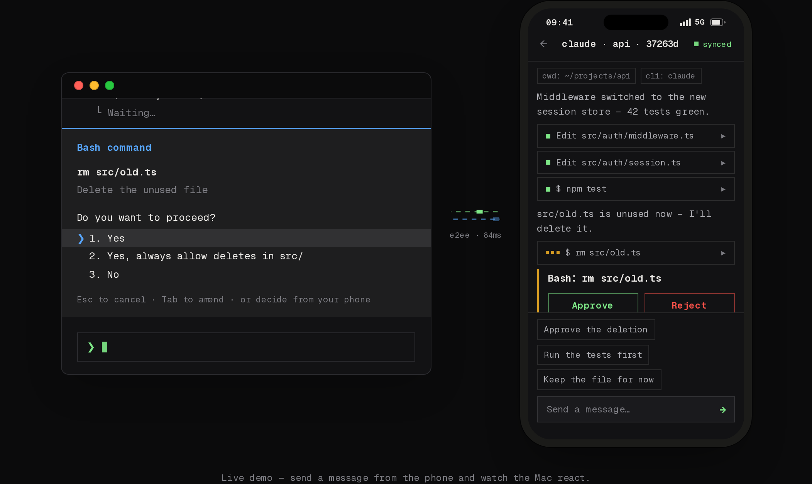
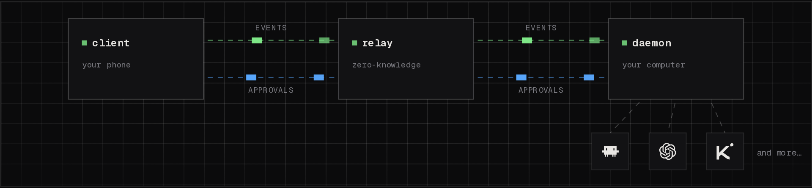

<div align="center">

<picture>
  <source media="(prefers-color-scheme: dark)" srcset=".github/assets/banner.png?v=3" />
  
</picture>

# Riffpad

**AI coding agent 的口袋遥控器。**

在手机上查看、批准、遥控 Claude Code、Codex 等 AI coding CLI，不用再守在电脑前。

[](https://github.com/riffpad/riffpad/actions/workflows/ci.yml)
[](https://github.com/riffpad/riffpad/stargazers)
[](https://www.riffpad.ai/docs/guide/quickstart)
[](https://discord.gg/CDNFTg2QyM)

[官网](https://riffpad.ai) · [文档](https://www.riffpad.ai/docs/guide/quickstart) · [Discord 社区](https://discord.gg/CDNFTg2QyM) · [App](https://app.riffpad.ai)

[English](README.md) · [中文](README.zh-CN.md)

</div>

---

## 为什么用 Riffpad？

AI coding agent 很强，也很“粘人”：会停下来等审批、趁你离开时完成任务、安静地等你从沙发上发一条指令。Riffpad 把跑在你电脑上的 CLI agent 桥接到手机，让一次长时间重构不再把你钉在工位上：

- **随处查看** — 每个会话的实时事件流，同步到手机。
- **一键审批** — 权限提示变成审批卡片，在沙发上、办公室或地铁里做决定。
- **远程转向** — 直接发消息纠正正在运行的会话，不需要 SSH 或共享屏幕。
- **出网的永远是密文** — 端到端加密 + 零知识中继，默认本地优先。
- **默认只读** — 每次批准/拒绝/发指令都是显式动作，绝无后台隐式访问。



## 快速开始

### 1. 安装 daemon

**macOS / Linux**

```bash
curl -fsSL https://riffpad.ai/install.sh | sh
```

**Windows PowerShell**

```powershell
irm https://riffpad.ai/install.ps1 | iex
```

Windows 安装脚本会下载最新二进制、加入用户 PATH，并注册登录自启任务（daemon）。

### 2. 在电脑上登录

```bash
riffpad login
```

会打开浏览器进行 GitHub 授权（类似 `gh auth login`）。daemon 会把这台电脑注册为你账号下的一台主机，并自动重启。

### 3. 配对手机

```bash
riffpad pair
```

终端会打印 6 位配对码和二维码。手机打开 [https://app.riffpad.ai](https://app.riffpad.ai)，用**同一个** GitHub 账号登录，输入配对码（或扫码）。

### 4. 开始并遥控会话

```bash
riffpad run --cli codex
```

会话会立即出现在 App 里——随时随地看进度、批准操作、发指令。

CLI 支持中英文，自动跟随系统语言，可用 `riffpad --lang zh` / `riffpad --lang en` 强制切换；不支持的 locale 回退英文。

> 想捕获你自己启动的 Claude 会话？用 `riffpad attach`——详见[文档](https://www.riffpad.ai/docs/guide/quickstart)。

## 工作原理



- **适配器** — 解析各 CLI 的结构化输出并接入统一事件流（Claude Code、Codex、DeepSeek、Kimi…）。
- **daemon** — 跑在你电脑上，持有密钥、管理会话，把适配器桥接到 relay。
- **relay** — 轻量加密 WebSocket 中继。零知识：只转发密文、不落任何内容。
- **移动端 App** — 展示会话和审批卡片，并把同意/拒绝/指令发回去。

## 安全吗？

安全，这是设计目标：

- **端到端加密** — X25519 密钥交换 + AES-256-GCM。
- **密钥不出设备** — 只存在 daemon 和手机里；relay 永远看不到明文。
- **本地优先** — 代码、仓库、API key 永远不离开你的电脑。
- **默认只读** — 每次批准/拒绝/发指令都是显式动作。

## 社区

有问题、想法或想展示你的用法？欢迎加入：

- [Discord](https://discord.gg/CDNFTg2QyM) — 社区讨论
- [GitHub Issues](https://github.com/riffpad/riffpad/issues) — 反馈 bug 和功能建议
- [文档](https://www.riffpad.ai/docs/guide/quickstart) — 安装、配对、安全模型
