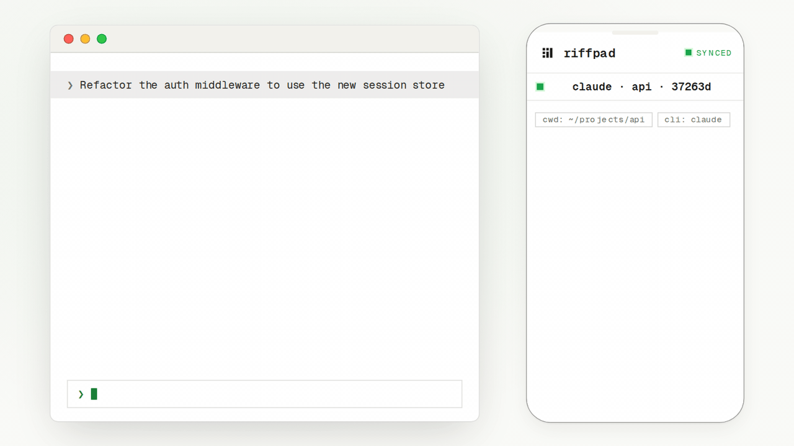
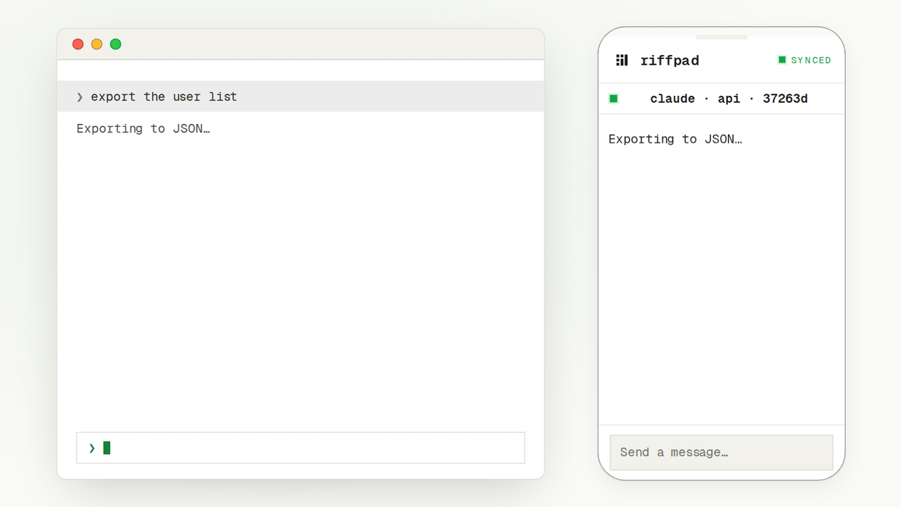
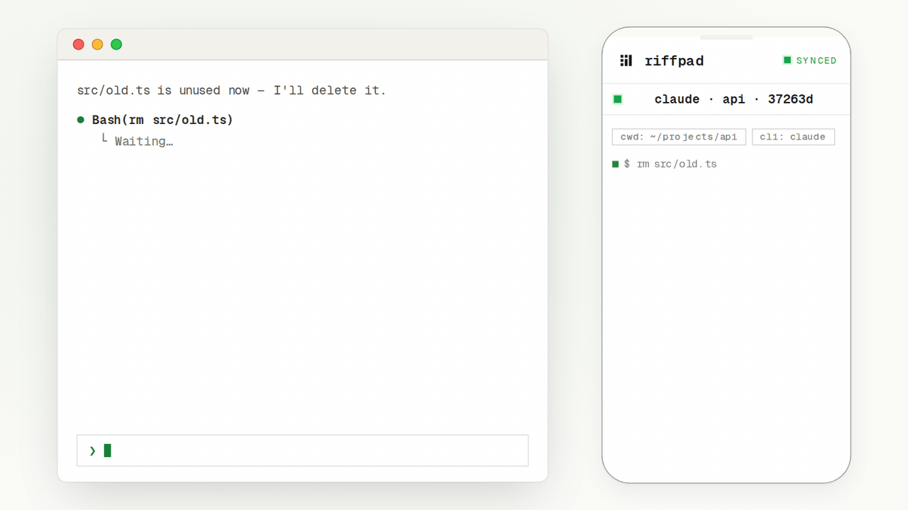

<div align="center">

# Riffpad

**在手机上查看、批准、遥控 Claude Code、Codex 等 AI coding CLI —— 不用再守在电脑前。**

[](https://www.riffpad.ai/docs/zh/guide/quickstart)
[](https://discord.gg/CDNFTg2QyM)
[](LICENSE)

[官网](https://riffpad.ai) · [文档](https://www.riffpad.ai/docs/zh/guide/quickstart) · [Discord 社区](https://discord.gg/CDNFTg2QyM) · [App](https://app.riffpad.ai)

[English](README.md) · [中文](README.zh-CN.md)

</div>

---

## 为什么用 Riffpad？

Riffpad 把跑在你电脑上的 AI coding CLI 桥接到手机，让长时间重构不再把你钉在工位上：

https://github.com/user-attachments/assets/ba55d433-2cb7-4469-98da-608fb828f583

**Watch（看）** — agent 的输出实时同步到手机：

<picture>
  <source media="(prefers-color-scheme: dark)" srcset=".github/assets/demo-1-watch.gif" />
  
</picture>

**Steer（转向）** — 在手机上发一条新指令，它会出现在运行中的终端里：

<picture>
  <source media="(prefers-color-scheme: dark)" srcset=".github/assets/demo-2-steer.gif" />
  
</picture>

**Approve（审批）** — 权限请求变成一键卡片：

<picture>
  <source media="(prefers-color-scheme: dark)" srcset=".github/assets/demo-3-approve.gif" />
  
</picture>

## 快速开始

> **用 AI agent？** 把这行粘进它的对话框 —— 它会读 skill 并帮你装好、配好 Riffpad：
>
> ```bash
> curl -fsSL https://riffpad.ai/SKILL.md
> ```

### 1. 安装 daemon

**macOS / Linux**

```bash
curl -fsSL https://riffpad.ai/install.sh | sh
```

**Windows PowerShell**

```powershell
irm https://riffpad.ai/install.ps1 | iex
```

Windows 安装脚本会下载最新二进制、加入用户 PATH，并注册登录自启任务（daemon）。

### 2. 在电脑上登录

```bash
riffpad login
```

会打开浏览器进行 GitHub 授权（类似 `gh auth login`）。daemon 会把这台电脑注册为你账号下的一台主机，并自动重启。

### 3. 配对手机

```bash
riffpad pair
```

终端会打印 6 位配对码和二维码。手机打开 [https://app.riffpad.ai](https://app.riffpad.ai)，用**同一个** GitHub 账号登录，输入配对码（或扫码）。

### 4. 开始并遥控会话

```bash
riffpad run codex
```

会话会立即出现在 App 里——随时随地看进度、批准操作、发指令。

CLI 支持中英文，默认英文。如需中文请显式使用 `riffpad --lang zh`；`riffpad --lang en` 可显式指定英文。

> 想捕获你自己启动的 Claude 会话？用 `riffpad attach`——详见[文档](https://www.riffpad.ai/docs/zh/guide/quickstart)。

## 工作原理


- **适配器** — 解析各 CLI 的结构化输出并接入统一事件流（Claude Code、Codex、DeepSeek、Kimi…）。
- **daemon** — 跑在你电脑上，持有密钥、管理会话，把适配器桥接到 relay。
- **relay** — 轻量加密 WebSocket 中继。零知识：只转发密文、不落任何内容。
- **移动端 App** — 展示会话和审批卡片，并把同意/拒绝/指令发回去。

## 安全吗？

安全，这是设计目标：

- **端到端加密** — X25519 密钥交换 + AES-256-GCM。
- **密钥不出设备** — 只存在 daemon 和手机里；relay 永远看不到明文。
- **本地优先** — 代码、仓库、API key 永远不离开你的电脑。
- **默认只读** — 每次批准/拒绝/发指令都是显式动作。

## 社区

有问题、想法或想展示你的用法？欢迎加入：

- [Discord](https://discord.gg/CDNFTg2QyM) — 社区讨论
- [GitHub Issues](https://github.com/riffpad/riffpad/issues) — 反馈 bug 和功能建议
- [文档](https://www.riffpad.ai/docs/zh/guide/quickstart) — 安装、配对、安全模型

## 开源协议

Riffpad 默认采用 **Apache-2.0**——CLI（`apps/daemon`）、各客户端
（`apps/client-beta`、`apps/mobile`）、官网/文档站以及共享的 `packages/`
库都是。详见 [LICENSE](LICENSE)。

relay 服务（`apps/relay`）采用 **Business Source License 1.1**——
源码公开，允许个人和内部使用（含自部署）；2030-08-09 起自动转为
Apache-2.0。详见 [`apps/relay/LICENSE`](apps/relay/LICENSE)。完整的协议
划分见 [`NOTICE`](NOTICE)。

Copyright (c) 2026 Liu Zhening.
